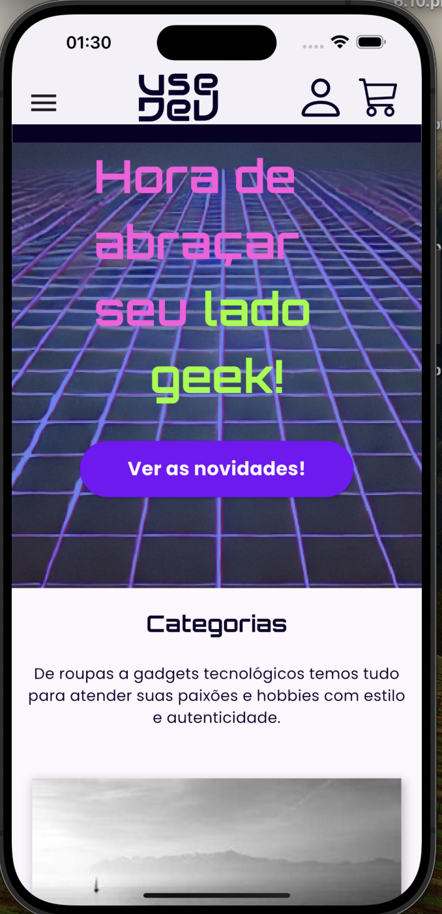
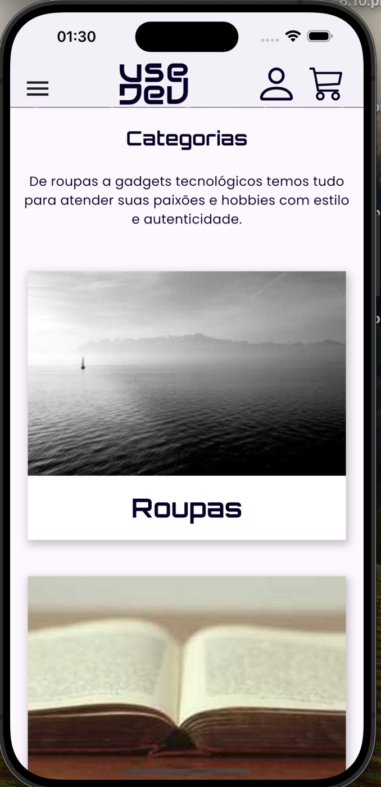
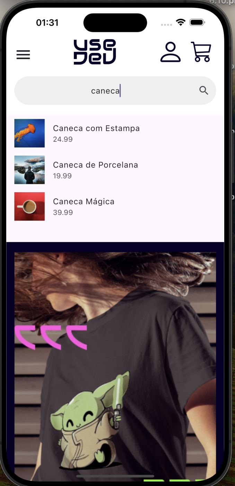
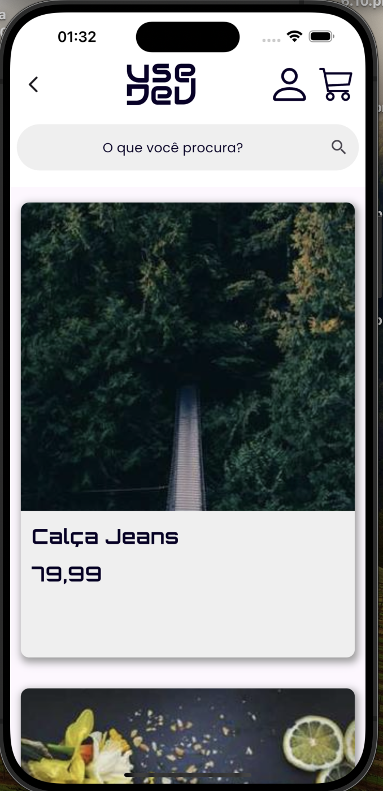
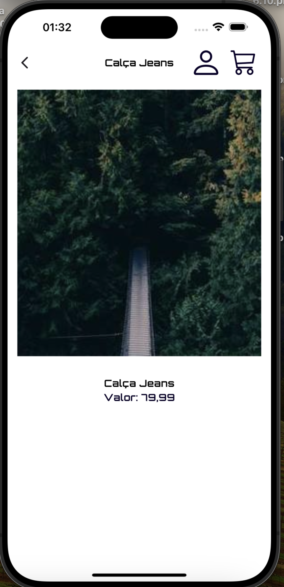
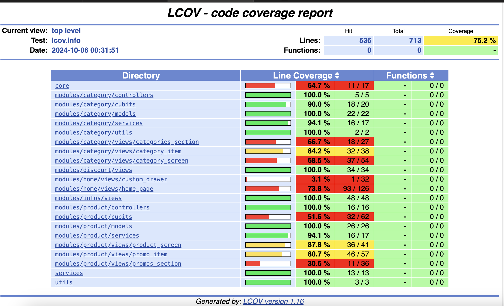

# Teste Técnico - Coordenador de Conteúdo Mobile

Este projeto faz parte do teste técnico para a vaga de Coordenador de Conteúdo Mobile. O aplicativo foi desenvolvido em **Flutter** e implementa listagem de categorias e produtos com filtragem local de produtos por nome ou categoria.

## Funcionalidades

- **Listagem de Categorias**: Exibe todas as categorias obtidas do endpoint fornecido.
- **Listagem de Produtos**: Exibe todos os produtos, permitindo filtragem por nome ou categoria.
- **Filtragem Local**: O filtro é aplicado localmente, sem a necessidade de novas requisições HTTP.
- **Paginação de Produtos em Promoção**: Exibe produtos em promoção com a funcionalidade de carregamento por paginação.
- **Filtros Personalizados por Categoria**: Permite que os usuários apliquem filtros personalizados na tela de categorias para refinar a busca.
- **Filtro de Produtos na Home**: Um filtro que permite ao usuário buscar produtos diretamente pela tela principal.

## Endpoints Utilizados

- **Categorias**: [Categorias JSON](https://gist.githubusercontent.com/viniciosneves/68bc50d055acb4ecc7356180131df477/raw/14369c7e25fca54941f5359299b3f4f118a573d6/usedev-categorias.json)
- **Produtos**: [Produtos JSON](https://gist.githubusercontent.com/viniciosneves/946cbbc91d0bc0e167eb6fd895a6b12a/raw/0f6661903360535587ebe583b959e84192cdb771/usedev-produtos.json)

## Pré-requisitos

Antes de começar, certifique-se de ter as seguintes ferramentas instaladas:

- [Flutter SDK](https://flutter.dev/docs/get-started/install)
- [Dart SDK](https://dart.dev/get-dart)
- [Android Studio](https://developer.android.com/studio) ou [Xcode](https://developer.apple.com/xcode/) para rodar em emuladores ou dispositivos.

## Instalação

1. Clone este repositório:
   ```bash
   git clone https://github.com/SEU-USUARIO/technical_project.git
   ```

2. Navegue até o diretório do projeto:
   ```bash
   cd technical_project
   ```

3. Instale as dependências:
   ```bash
   flutter pub get
   ```

4. Execute o aplicativo em seu dispositivo ou emulador:
   ```bash
   flutter run
   ```

## Estrutura do Projeto

O projeto foi estruturado utilizando a arquitetura **MVC** para separar a lógica de negócios, a interface do usuário e o acesso a dados. Essa abordagem facilita a manutenção e a escalabilidade do código.

## Capturas de Tela












## Testes

Para rodar os testes (caso implementados), utilize o comando:

```bash
flutter test
```

## JSON

Caso haja necessidade de ajustes nos arquivos JSON fornecidos, você pode modificá-los conforme necessário, desde que as propriedades sejam mantidas. O projeto utiliza os seguintes endpoints para categorias e produtos:
- [Categorias JSON](https://gist.githubusercontent.com/viniciosneves/68bc50d055acb4ecc7356180131df477/raw/14369c7e25fca54941f5359299b3f4f118a573d6/usedev-categorias.json)
- [Produtos JSON](https://gist.githubusercontent.com/viniciosneves/946cbbc91d0bc0e167eb6fd895a6b12a/raw/0f6661903360535587ebe583b959e84192cdb771/usedev-produtos.json)

## Licença

Este projeto está licenciado sob a MIT License - veja o arquivo [LICENSE](LICENSE) para mais detalhes.
